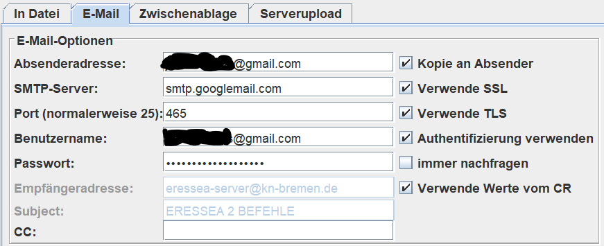
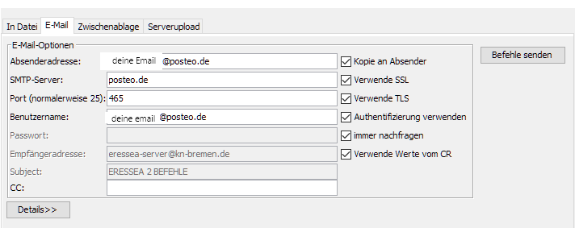

---
# cSpell:locale en
alias: sending-orders-from-magellan
---
# Sending orders from Magellan

<!-- TODO: magellan screenshot 400X134 - should be where in the page ? -->

[[magellan]] offers the possibility of [[sending-orders|emailing]] the orders directly from the program.  
The advantage of this is that there are no errors caused by copying into the e-mail program or webmailer.
More, they do not do any automatic formatting that the Eressea server does not understand, for example HTML formatting, strange line breaks, automatic banners or strange letter encoding, especially with umlauts.  
To have a copy of the email sent, you can send a copy of the orders to your own address.  
To do this, you have to make the appropriate settings in Magellan, including the correct data from the mail provider's SMTP server.  
The data is usually obtained from the provider's help, for some the data is given below.  
In addition, the provider may have to explicitly grant permission for external programs.  

## In Magellan

The setting can be found at `File => Save Orders...`, in the second tab `E-Mail`.  
Once the settings have been made, you can also directly send your e-mail via `File => Send orders by E-Mail`.  

**Return address:** Your email  
**SMTP server:** From the mail provider (see below)  
**Port:** From the mail provider  
**Username:** Your username with the email provider
**Password:** Password from email provider, **not** the Eressea orders password
**Recipient address:** <eressea-server@eressea.kn-bremen.de>  
**Subject:** ERESSEA 2 ORDERS  
**CC:** Optional, for example your own address  

**Copy to sender:** Also sends the orders to the sender address  
**Use SSL/TLS:** email encryption; Should be selected if possible if supported by the mail provider (if in doubt, just try it out)  

**Use authentication:** usually necessary  

**always ask:** Requests the mail provider password every time you send it, so it doesn't have to be saved in Magellan  
**Use values from CR:** Automatically fills the recipient address and subject if the data is in the CR  

For some well-known mail providers, here are the required values, as far as is currently known.

## GMX

GMX's help for the SMTP server can be found at [GMX Support - SMTP], and to the SMTP settings under [GMX Support - SMTP server].  
In addition, it is necessary to grant external authorization to send.  
This will be explained (including video) at [this other GMX Support link].  

**Return address:** Your email at GMX  
**SMTP server:** mail.gmx.net  
**Port:** 587 (with TLS) or 465 (with SSL)  
**Username:** Your username at GMX (either your email address or your user number)  
**Password:** password from GMX, **not** the Eressea orders password  

**Use SSL:** Yes (With port 465, otherwise no)  
**Use TLS:** Yes (With port 587, otherwise no)  
**Use authentication:** Yes  

## Gmail

<!-- TODO: - should be where in the page ? -->

**Return address:** Your email on Gmail  
**SMTP server:** smtp.googlemail.com  
**Port:** 465  
**Username:** Your Gmail username  
**Password:** Gmail password, **not** the Eressea orders password  

**Use SSL:** Yes  
**Use TLS:** Regardless, both work  
**Use authentication:** Yes  

!!! warning "Caution"
    From May 30, 2022 at the latest, this will no longer work simply with the Gmail password ([unsecured applications and Gmail]).  
    Instead, you have to set up a so-called use app password.  
    The Gmail documentation reveals more details: [application password and Gmail].  
    Instead of the Gmail password, you simply enter the app password in Magellan.

## Freenet

**Return address:** Your email at Freenet  
**SMTP server:** mx.freenet.de  
**Port:** 587  
**Username:** Your username on Freenet  
**Password:** Password from Freenet, **not** the Eressea orders password  

**Use SSL:** Yes  
**Use TLS:** Yes  
**Use authentication:** Yes  

## Posteo

<!-- TODO: orders sending with Posteo 400X159 - should be where in the page ? -->

**Return address:** Your email at Posteo  
**SMTP server:** posteo.de  
**Port:** 465  
**Username:** Your email at Posteo  
**Password:** Password from Posteo, **not** the Eressea orders password  

**Use SSL:** Yes  
**Use TLS:** Yes  
**Use authentication:** Yes  

<!-- From [https://wiki.eressea.de/index.php?title=Befehle\_von\_Magellan\_verschicken&oldid=7407] -->

[GMX Support - SMTP]: https://support.gmx.com/pop-imap/index.html
[GMX Support - SMTP server]: https://support.gmx.com/pop-imap/pop3/serverdata.html
[this other GMX Support link]: https://support.gmx.com/pop-imap/toggle.html
[unsecured applications and Gmail]: https://support.google.com/accounts/answer/6010255
[application password and Gmail]: https://support.google.com/accounts/answer/185833
