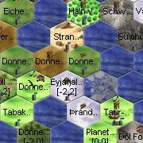
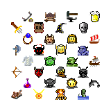
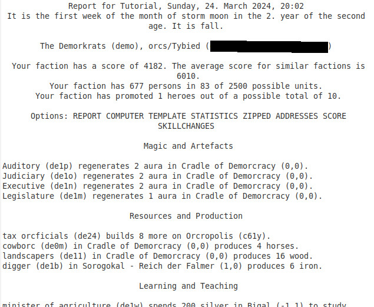
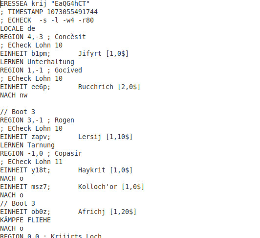

---
# cSpell:locale fr
alias: introduction-fr
---

{ #introduction-fr-id }

# Introduction

<!-- TODO: logo 180X180 - should be to the left or right part of the page -->

Dans Eressea, chaque joueur prend en charge une [faction][faction] de personnes d'un [peuple][peuples] donné, qu'il devra choisir lors de l'[inscription][inscription].  

Les joueurs sont ensuite plongés avec quelques autres dans [le monde d'Eressea][le-monde-d-eressea-id] et peuvent alors commencer à explorer les alentours.

<!-- TODO: icons 160X160 - should be to the left or right part of the page -->

Eressea est un monde fantastique.  

Des êtres comme les [Elfes][elfes]{title="Elves"} et les [Nains][nains]{title="Dwarves"} peuplent le monde, et la [magie][magie] fait partie du quotidien.  
Même des [dragons][dragons-connus] ont été aperçus, des [monstres][monstres] imposants, puissants et surtout dangereux, qui nécessitent des centaines de soldats pour les affronter.  
On peut aussi y rencontrer des [serpents de mer][serpents-de-mer], des [Ents][ents-fr-id]{title="Ents"} et d'autres créatures étranges.

Eressea est un vaste monde. Des centaines de peuples vivent sur les îles d'Eressea, et la plupart ne se rencontreront probablement jamais, car il peut falloir des années pour combler les distances.  

Eressea est un monde complexe.  

Diriger un peuple n'est pas tâche facile. Beaucoup d'éléments sont à prendre en compte pour que tout se passe sans accroc, et c'est sans compter l'intervention de vos voisins !  
Il faut trouver des accords, il se peut qu'il y ait des querelles, pouvant aller jusqu'à la [guerre][guerre].  

Même si tout se passe bien, gérer sa faction dans Eressea prendra beaucoup de temps.  
Alors qu'au début, une heure par semaine devrait suffire, cela peut monter à dix heures et plus par semaine.  

<!-- TODO: NR report 160X160 - should be to the left or right part of the page -->

Il n'existe pas d'objectif de jeu prédéfini dans Eressea, pas de fin à atteindre.  
Vous pouvez vous fixer des objectifs d'étape à atteindre : la construction d'un empire commercial, la conquête d'une île entière, l'exploration d'un maximum de régions ou tout autre objectif.  

Quoi qu'il en soit, vos décisions et vos actions auront un impact sur le monde d'Eressea, dont vous influencerez le destin.  

## Comment fonctionne le jeu

<!-- TODO: orders 160X160 - should be to the left or right part of the page -->

Dans Eressea, vous envoyez un lot d'**ordres** à intervalles réguliers.
Un lot est composé d'[ordres][ordres] que les unités de votre faction exécuteront du mieux qu'elles pourront.  
Il s'agit d'une série d'instructions interprétées et évaluées par le serveur Eressea, programme informatique qui connaît l'état du monde d'Eressea.  
Le serveur évalue les lots d'ordres de tous les joueurs et détermine ainsi le nouvel état du monde.  

Le rythme des lots est d'un par semaine.  

!!! warning "Attention"
    La **date limite de remise des lots d'ordres est le samedi soir à 21h00** (CET).  

En réponse à votre **lot d'ordres**, vous recevrez un **rapport** qui contient l'état du monde connu par votre faction.  

Le rapport complet (fichier d'extension `.zip`) se compose de plusieurs éléments :

- un [rapport standard][nr-fr-id] (fichier d'extension `.nr`, pour « normal report »), qui présente un rapport textuel, lisible par un humain
- un [rapport informatique][cr-fr-id] (fichier d'extension `.cr`, pour « computer report »), qui présente les mêmes informations, mais sous une forme utilisable par des [programmes][ce-que-vous-devez-considerer-lors-de-la-saisie-des-ordres] adaptés
- un [modèle d'ordres][modele-d-ordres-id] (fichier d'extension `.txt`) pouvant servir de modèle pour votre prochain tour de jeu

Le rapport peut aussi contenir un [point hebdomadaire][rapport-hebdomadaire], qui présente différentes statistiques sur l'état général du monde d'Eressea, et enfin, parfois, le [Xontormia Express], la gazette alimentée par les écrits des joueurs.  

Si, après la date limite, aucun lot d'ordres n'est parvenu au maître de jeu pour une faction donnée, un événement appelé **NMR** (pour `No Move Received`) est associé à la faction.  

!!! warning "Bon à savoir"
    En cas de 4 **NMR** consécutifs, la faction est automatiquement retirée du jeu, et supprimée au 5ème NMR.

Poursuivre la lecture : [le monde d'Eressea][le-monde-d-eressea-id].

<!-- From [https://wiki.eressea.de/index.php?title=Einleitung/fr&oldid=16807] -->

[Xontormia Express]: https://wiki.eressea.de/xontormia_express
