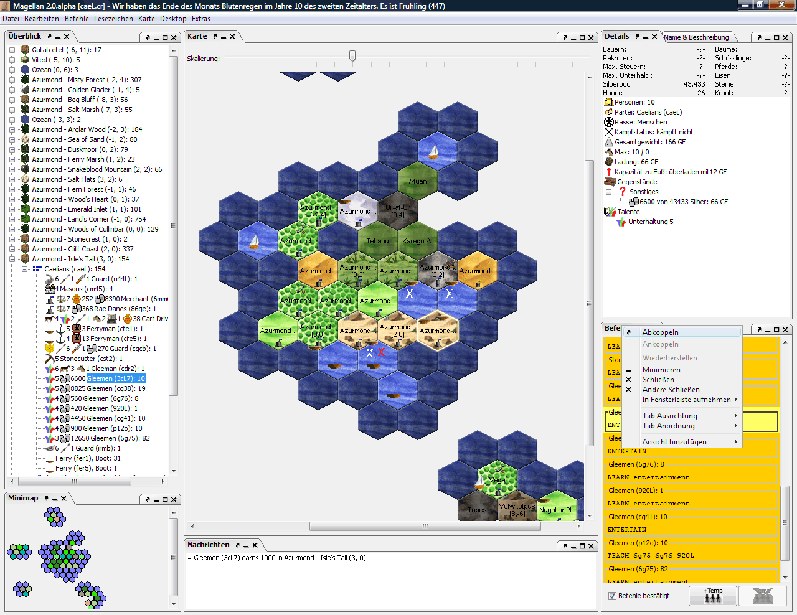

---
# cSpell:locale fr
alias: magellan-fr
---

{ #magellan-fr-id }

# Magellan

[Magellan][magellan-ext] est un client à part entière d'Eressea.  
Vous pouvez l'utiliser pour afficher votre carte, rechercher, donner des ordres, et tout ce qu'il vous reste à faire est de quitter le programme pour écrire des emails à vos alliés...Presque  

Magellan est en mode de développement modéré, et évolue principalement lors de modifications du serveur.  

<!-- TODO: magellan screenshot 400X309 - should be where in the page ? -->

Les fonctionnalités incluent :

- Affichage de la carte, des unités, des détails de la région et toutes les autres propriétés du rapport.
  La disposition des différentes fenêtres peut être ajustée librement
- Éditeur d'ordres complet avec saisie semi-automatique et vérification de la syntaxe
- Fonctions de prédiction étendues, par exemple pour la remise d'objets et les itinéraires
- Vérification approfondie des ordres et affichage des "problèmes en cours".
  Élimine le besoin d'outils supplémentaires tels que [ECheck][echeck-id]
- Envoi des ordres par e-mail directement depuis le programme
- Importation et exportation de rapports (partiels) et de cartes pour échange avec d'autres joueurs
- Navigation rapide grâce aux raccourcis clavier, recherche d'unités, signets...
- Statistiques de faction avec affichage de tous les objets, compétences, revenus, etc.
- Planificateur d'alchimie pour un aperçu des plantes et des potions
- Options de réglage étendues pour adapter Magellan à vos propres préférences
- Possibilité de colorer et d'étiqueter les cartes selon des critères librement définis, par exemple pour obtenir un aperçu de la répartition des marchandises commerciales, de la croissance des agriculteurs, de la répartition des matières premières ou d'autres factions
- Interface de programmation de commandes étendues pour automatiser les ordres comme vous le souhaitez
- Des plugins qui peuvent étendre encore plus les possibilités

Veuillez signaler les rapports de bugs et les demandes de fonctionnalités pour Magellan sur notre [bug tracker].

Magellan offre la possibilité d'envoyer des ordres directement depuis le programme.  
Ce qui doit être fait, en fonction du fournisseur, est expliqué dans l'[envoi des ordres depuis Magellan][sending-orders-from-magellan].  

Une ancienne version de Magellan ([Magellan 1]) n'est plus maintenue.  
Bien qu'elle ait atteint un état stable, les développements plus récents du serveur Eressea n'y sont pas pris en compte.  

La dernière version de Magellan est disponible sur cette [page de téléchargement].

## Liens externes

- [Magellan][magellan-ext]
- [Page de téléchargement de Magellan][page de téléchargement]
- [Bug tracker pour Magellan][bug tracker]
- [Code source de Magellan (pour les développeurs)]
- [Magellan dans SourceForge (**obsolète**)][Magellan 1]

<!-- From [https://wiki.eressea.de/index.php?title=Magellan&oldid=7285] -->

[bug tracker]: https://magellan2.github.io/bugs/
[page de téléchargement]: https://magellan2.github.io/en/download/
[magellan-ext]: https://magellan2.github.io/en
[Code source de Magellan (pour les développeurs)]: https://github.com/magellan2
[Magellan 1]: http://sourceforge.net/projects/magellan-client
