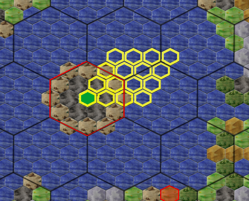

---
# cSpell:locale en
alias: magic
---
<!-- disable some rules due to autorefs plugin usage -->
<!-- markdownlint-disable MD041 MD042 MD052 -->

[](){ #magic-id }

# Magic

Magic is a mystical and powerful way to change and create things and can weaken the enemy or strengthen allies in [[war]].

## The Study of Magic

Each faction must choose one of the five [[schools-of-magic]]: [[illaun-spells|Illaun]], [[tybied-spells|Tybied]], [[gwyrrd-spells|Gwyrrd]], [[cerddor-spells|Cerddor]] or [[draig-spells|Draig]].  

The faction's magic area is determined by the very first unit that learns magic in the faction.
This is done using the [[cmd-learn|`LEARN MAGIC "<magic school>"`]].  
As a result, the order is now just called `LEARN MAGIC "<magic school>"` and all magicians of a [[factions|faction]] then automatically learn the magic school chosen by the faction.  
However, it is possible to order multiple units to `LEARN MAGIC "<magic school>"` if you are unsure which unit will come first.  

!!! note
    Once a magic school has been chosen, **it cannot be changed**.  
    Therefore, this decision needs to be carefully considered!

There can be a **maximum of five magician units per faction**;
only **elven factions** are allowed to have **6 magicians**.  
Mage units may only consist of one person.
You cannot hand over people, even to empty `TEMP` units.  

The skill to learn magic costs `50 + 25 * (1 + Level) * Level` Silver per person per round.

Learning costs.

| Next level | 1   | 2   | 3   | 4   | 5   | 6    | 7    | 8    | 9    | 10   | 11   | 12   | 13   | 14   | 15   | ... | 20    | ... | 30    | ... | 40    |
|------------|-----|-----|-----|-----|-----|------|------|------|------|------|------|------|------|------|------|-----|-------|-----|-------|-----|-------|
| Cost       | 100 | 200 | 350 | 550 | 800 | 1100 | 1450 | 1850 | 2300 | 2800 | 3350 | 3950 | 4600 | 5300 | 6050 | ... | 10550 | ... | 23300 | ... | 41050 |

So an untrained magician pays 100 Silver for his first lessons;
If he already has level 5 in magic skill, he has to pay 1100 Silver per week of learning.  

!!! warning "Caution"
    The learning cost always refers to the level learned before any racial bonuses or penalties are applied.  
    So an elf pays 100 and not 200 silver for her first learning attempt that brings her to T2.  
    A goblin with his -1 pays 200 silver for the second learning attempt even though he is still at level 0 (The system evaluates it as T1 -1 = 0).  

!!! info "Caution, dwarves"
    You have -2 to magic skill.  
    A unit that appears as Magic 0 may actually be at T1 or T2.  
    In the latter case, however, the learning costs increase to 350 silver!  
    There is no way to know which of the two is true. So it's better to plan a little more generously.  

Learning in an [Academy][academy] costs twice as much.
Only magicians from the same area of ​​magic as the teacher can be taught.
So a Draig Mage cannot teach an Illaun Mage.  

If a mage unit does not have enough silver to learn, it will only learn in proportion to the amount of silver it can pay for each week.
<!-- TODO: clarify this not understable sentences -->
Magic can also, through [Special:MyLanguage/Talente|Application (CAST)].
It doesn't matter whether the unit casts one or more spells per round.
Of course, learning through application does not cost silver.  

## Sayings

With each level the unit gains in magic, it can gain new spells.
There is currently one spell in each level, in exceptional cases several or none at all.
Once you have reached a new level, the sayings are described in the evaluation.
If you have forgotten the description, you can have it shown again using the [[cmd-show]] command.

```text
Eine so angezeigte Spruchbeschreibung sieht ungefähr so aus:

                                Wunderdoktor

Beschreibung:
    Wenn einem der Alchemist nicht weiterhelfen kann, geht man zu dem gelehrten
    Tybiedmagier. Seine Tränke und Tinkturen helfen gegen alles, was man sonst
    nicht bekommen kann. Ob nun die kryptische Formel unter dem Holzschuh des
    untreuen Ehemannes wirklich geholfen hat - nun, der des Lesens nicht
    mächtige Bauer wird es nie wissen. Dem Magier hilft es auf jeden Fall...
    beim Füllen seines Geldbeutels. 50 Silber pro Stufe lassen sich so in einer
    Woche verdienen.
Art: Normaler Zauber
Stufe: 1
Rang: 5
Komponenten:
    -   1 Aura  * Stufe
Modifikationen: Schiffszauber
Syntax:
    CAST [LEVEL n] Wunderdoktor
```

or so

```text
              Erschaffe einen Ring der Unsichtbarkeit

Beschreibung:
    Mit diesem Spruch kann der Zauberer einen Ring der Unsichtbarkeit
    erschaffen. Der Träger des Ringes wird für alle Einheiten anderer Parteien
    unsichtbar, egal wie gut ihre Wahrnehmung auch sein mag. In einer
    unsichtbaren Einheit muss jede Person einen Ring tragen.
Art: Normaler Zauber
Stufe: 6
Rang: 5
Komponenten:
    - 50 Aura
    - 3000 Silber
    - 1 permanente Aura
Modifikationen: Schiffszauber
Syntax:
    CAST 'Erschaffe einen Ring der Unsichtbarkeit'
```

### Spell types

There are normal spells, pre-combat spells, combat spells and post-combat spells.

Normal spells are cast using the [[cmd-cast]] order.
Their effect occurs either immediately (see [[orders-sequence]]) or sometimes at a later point in time, for example at the beginning of the following round.  

The three types of combat spells can never be cast using `CAST`.
Instead, they are cast when the unit is actively engaged in combat.  
All three types can be set with the [[cmd-combatspell|`COMBATSPELL LEVEL n "Spell"`]] order.  
You can delete a specific combat spell with the `COMBATSPELL "Spell" NOT` order or all set combat spells with [[cmd-combatspell|`COMBATSPELL NOT`]]
Combat spells work somewhat like the [`COMBAT`][combat-rows] orders, i.e. once set, they remain saved.
A unit can have a maximum of one pre-combat spell, one combat spell, and one post-combat spell.
For example, if the unit already has a pre-combat spell and casts a new pre-combat spell, the old one is replaced by the new one.

```text
                        Song of Fear

Description:
    A very powerful song from the traditions of cats that runs deep within
    penetrates the hearts of enemies and robs them of courage and hope. Fear will
    making her tremble and panic take over her thoughts. Become full of fear
    They try to escape the horrible songs and flee.
Art: Combat spells
Level: 3
Rank: 5
Components:
    -   1 Aura  * Level
Modifiers:
Syntax:
    COMBATSPELL [LEVEL n] 'Song of Fear'
```
<!-- TODO check if below is what german text meant -->
If a mage has cast combat spells, it automatically casts spells as soon as it takes part in combat, either by ordering `ATTACK` himself or by being drawn into battle by an attack on his side (see [The Sides in a Battle][the-sides-in-a-battle]).  
This can also happen even if he is set to `COMBAT NOT` or `FLEE`, when he is explicitly attacked with the [[cmd-attack]] order!

A pre-combat or post-combat spell is cast once before or after the combat begins.
A normal combat spell once per combat round. Of course, only under the condition that the unit still has sufficient aura (see under [Aura][aura-id]) and that it is still alive.

[](){ #aura-id }

### Aura

Aura is the magical power that magicians use to perform their magic.  
Aura is consumed by casting spells and regenerates over time.  
A mage unit can absorb a certain maximum amount of aura.  
How much is determined -just like aura regeneration -by the unit's magical skill.  
The exact information for each unit is in the report, As a rule of thumb.  
However, the maximum is skill<sup>2</sup> Aura lies and on average around (skill level) aura is regenerated per week.  
But that can vary between almost nothing and talent level.  
Magical races regenerate aura faster, non-magical races significantly slower.  

The maximum aura is not immutable: on the one hand, there is a spell that allows one unit to transfer aura to another.  
This allows the target unit to temporarily receive more aura than it can normally absorb.  
This allows her to cast spells that cost more than her maximum aura. However, excess aura is lost again at the end of a round.  

There are also spells (and possibly other things) that cost mages permanent aura, such as "Create a Ring of Invisibility".  
This means that the unit can now store less maximum aura.  
These are usually very powerful spells or artifact magic that cause permanent effects.  

[[cmd-cast]] is a pseudo-long command comparable to [[cmd-attack]].  
A unit can therefore cast spells several times per round, but cannot carry out any other long command.  
But there is a catch: the aura costs of the spells increase. The first spell the unit casts in a round costs the normal aura specified in the spell.  
The second costs twice as much, the third four times as much, the fourth as eight times, etc.  

Combat spells are treated separately; they do not increase the cost of normal spells or other combat spells and always only cost the specified aura.  
[Ranged Spells][ranged-spells] also increase the casting cost.  

### Caster level

The value specified as "level" is initially the minimum skill at which the unit gets the spell.  

Some spells have fixed effects and costs.  
They are always cast at the spell's level and cannot be changed by parameters.  
It can still be important for things like [Magic Resistance][magic-resistance-id].  
**Create A Ring of Invisibility** is always cast at level 6 and produces exactly one ring.  

Many spells have level-dependent effects and costs.  
Its effect is derived from the level at which the spell was cast.  
The details depend on the spell in question.
Sometimes it concerns the duration of the effect, sometimes the number of people enchanted, and so on.  

With these variable spells you can specify a level at which the spell should be cast.  
This must be equal to or lower than the unit's magic skill, but it can be higher or lower than the spell's normal level.  
This allows you to cast the spell at a lower level than your own skill.

Using a [[ring-of-power]], [Mage Tower][mage-tower-id] or [Bless Stone Circle][bless-stone-circle], the strength can be increased by an additional point.  
This bonus is added to the specified level.

If the level is omitted, the spell is cast at the maximum possible level, i.e. the unit's skill value (modifications such as racial bonuses or special bonuses such as those for insects in deserts are taken into account).  
One reason this isn't always desirable is that the level also affects the probability of [blunders][blunder].  

This modification also works on combat spells:

```text
COMBATSPELL LEVEL 2 "Song of Fear"
```

This is useful, for example, if you want to save some aura so that you have some aura left for a post-combat spell.

**Example:**

```text
CAST LEVEL 4 "Miracle doctor"
```

This spell will cost 4 aura and earn 200 silver.  
With a Ring of Power it still costs 4 aura but earns 250 silver.  

### Components

If it simply says the number of aura, it means that the costs are fixed:*Ring of invisibility*always costs 50 aura.  
Is there any information there such as: `3 Aura * Level`, then this means that for casting a spell once, the aura cost is 3 aura multiplied by the level at which the spell is cast.  
**Miracle Doctor** costs 1 aura when cast at level 1 and 30 aura when cast at level 30.  
If the spell requires permanent aura, the unit's maximum aura is permanently reduced by that value.  
Other components can include herbs, raw materials, silver, potions or even rare items and even farmers.  

### Ranged spells

Ranged spells are cast in the mage unit's region, but work in a different one. You can then use the following syntax for these spells:  

```text
CAST REGION <x> <y> "<Spell>>"
```

The spell is then cast in the specified region.  
The X and Y coordinates refer to the [[cmd-origin]].  
However, this modification increases the cost of all components of the spell exponentially.  
The cost of material components and aura are doubled per region of distance between the unit's location and the target.  
Formula: 2<sup>a</sup>, where a is the distance of the target region to the region of the unit.  

For illustration:

| Distance regions (a) |  0 |  1 |  2 |  3 |   4 |
|----------------------|---:|---:|---:|---:|----:|
| **Stone** required   |  1 |  2 |  4 |  8 |  16 |
| **Iron** required    |  5 | 10 | 20 | 40 |  80 |
| **Wood** required    | 10 | 20 | 40 | 80 | 160 |

Aura cost is also increased if a unit casts multiple spells in one turn (Formula: 2<sup>b-1</sup>, where b is the number of spells in this round, see [above][aura-id]).  
This does not apply to other components; they are only increased by long-distance spells.  

Distance spells and multiple spells can also increase the aura costs in combination:  

| Distance regions (a)  |     0       |     1       |     2        |     3        |     4        |
|-----------------------|-------------|-------------|--------------|--------------|--------------|
| Aura cost (1st spell) | Aura cost*1 | Aura cost*2 | Aura cost*4  | Aura cost*8  | Aura cost*16 |
| Aura cost (2nd spell) | Aura cost*2 | Aura cost*4 | Aura cost*8  | Aura cost*16 | Aura cost*32 |
| Aura Cost (3rd Spell) | Aura cost*4 | Aura cost*8 | Aura cost*16 | Aura cost*32 | Aura cost*64 |

The two modifiers can also be linked:

```text
CAST REGION <x> <y> LEVEL <number> "<spell>"
```

It is important that you first specify the region and then the level.

**Example:**

A unit in the region (1,1) casts "Blessing of the Earth" at level 3 in the neighboring region to the east as the first spell of the round (a = 1 field distance).  
That costs 2*3 = 6 aura. The order for this spell is `CAST REGION 2 1 LEVEL 3 "Segen der Erde"`.  

### Ship and sea magic

In addition to long-distance spells, there are also two other classes of special spells.  

In general, spells can **not from departing ships** be conjured up.  
The only exceptions are those **Ship magic** designated sayings.  

Sayings that as **Sea magic** marked can also be cast by non-Aquarians on the ocean.  

### Magic with people and objects

Some spells can be used to magically influence people and objects.  
It should be noted that the vast majority of spells to be cast on friendly units require that the target unit contact the magician with [[cmd-contact]].  
Teleports and other enchantments can be well-intentioned, but can often be used for misdeeds, and with [[cmd-contact]] the target signals that they agree to the enchantment.  

### Rank

The order of normal spells is determined by the rank of the spell.  
Within a round, spells with a lower rank are always executed before those with a higher rank.  
Rank 1 is the lowest and rank 9 is the highest.  
Most spells have a standard rank of 5, but antimagic spells almost all have a rank of 2, so they may be cast before normal spells.  
Spells of the same rank are cast in the order specified on the turn.  

**Example:**

There would be three spells, called "Aaa", "Bee" and "Cee" :

- "Aaaa" is rank 5 and costs 10 aura
- "Beee" is rank 2 and costs 20 aura
- "Ceee" is rank 5 and costs 5 aura

Assuming the unit has the orders :

```text
CAST "Ceee"
CAST "Beee"
CAST "Aaaa"
```

in that order.  
“Beee” is cast first, because the spell has rank 2.  
It's the unit's first spell this week, so it costs 20 aura.  
Then "Ceee" is cast, because "Aaaa" and "Ceee" have the same rank and "Ceee" comes before "Aaaa".  
"Ceee" is the second spell, so it costs 5*2^1=10 aura. Now comes “Aaaa”.  
"Aaaa" is the third spell, so it costs 10*2^2=40 aura.  

## Blunder

There is a lot that is not obvious in the magic system and in the spells.  
In general, many sayings contain direct or indirect risks.  
A magician can also botch a spell.  

A spell can simply fail like that, even if all the components are actually there and the aura of unity is sufficient.  
This is not a bug and also gives a completely normal message in the report ("The spell fails.").  
If components or aura are missing, this will also be mentioned in the message.  

The probability of a blunder depends on many factors, including the level, difficulty of the spell relative to the level at which the spell is cast by the magician, the magic area, the spell, the environment, the target, etc.  

Mistakes can have extremely unpleasant side effects! However, if the unit survives a blunder, these are usually not permanent.  

Player experience (Solthar):

A spell that is cast at the maximum possible level has approximately 20% chance of failure; at half level there is 0% chance.  
For draigmages it is 10% more. Possible consequences (in descending order of frequency):

- The spell works, but subsequent spells become much more expensive
- All aura is lost, the spell works or not
- The spell doesn't work and you become a [[toad]] for 2 or more weeks
- The spell doesn't work and there is a special effect

Special effects mainly affect Gwyrrd (enraged Ents are created) and Draig (pawn mobs or other consequences).  

[](){ #magic-resistance-id }

## Magic resistance

A person/unit's magic resistance is each person's inherent ability to resist a spell cast against them, and how severely a person is affected by magical damage in combat.  
A unit's magic resistance is:

- the natural magic resistance of the [[races]]
- plus 5% per magic skill
- plus 10%*Unicorns per person
- Possibly bonus or penalty due to [[list-of-spells|spell]] on the unit or region
- Possibly bonus from [building][stonecircle]
- These values ​​are added together, but the result can never be higher than 90%

For certain direct enchantments, it is additionally influenced by the unit's experience:

- 50% + 5%*(Highest skill value of the enchanted unit - magic skill of the casting unit)
- Never below 2%, never above 98%

Instead, additional bonuses from [Weapons or Armor][war-tables-magic-resistance-id] work against combat spells such as fireballs and weapons that are considered magical.  
Otherwise, only magical protection and natural armor work against magical damage.  

Even "inanimate matter", i.e. regions, ships, buildings, etc., sometimes have magic resistance. It can also be strengthened by certain spells.  

 **Examples:**

The base chance is 0% for humans, 10% for [[skills-modifiers|elves]], for [[skills-modifiers|goblins]] it is only -5%.  
A Mining 10 unit has a 50% chance to resist a spell like [Chaos Curse][d-chaos-curse-id] cast by a Magic 10 unit.  
If the magic skill is 12, the chance drops to 40%. If the target unit consists of goblins, the chance drops further to 35%.  
<!-- TODO : check original -->
For example, a fireball that would do 50 damage (5d10 + 15) only does 90% against an elf with [Laensword][war-tables-magic-resistance-id].*70% = 63% of that, so about 31 damage.

## Mage Tower

A [Mage Tower][mage-tower-id] increases aura regeneration by 75% and increases the effective level of any spell cast within them by 1, if applicable, in addition to a Ring of Power without increasing the cost.  
In addition, the likelihood of a spell failure is significantly reduced.

## Familiar

Experienced magicians will at some point on their wanderings encounter an unusual specimen of a species that will join them.  
Which genus this creature belongs to depends primarily on the area of ​​magic and race.  

More information about these creatures: [[familiars]].

## The Astral Space

!!! note
    You can also skip this section if you are reading the instructions for the first time -as it takes many weeks before a party can travel into the astral space -or if you prefer to figure out the complicated rules of the astral space yourself.

Opinions on what this second plane of existence actually is vary as widely as the names given to it: some call it the **world of spirits**, others the **Astral world**, but the most well-known term is **Astral plane**.  
Completely different laws of nature prevail in this other world.  
This fact may be the only reason why the Astral plane has remained a practical application of magic at all: those who manage to blur the boundary between the Astral plane and reality at the right moment using their magical powers can gain great advantages – be it through perceiving things on the other side without being seen themselves, or through rapid travel over great distances.  

Anyone who enters the Astral space -this is only possible through certain [[list-of-spells|spells]] -disappears completely from the real world.  
Like the real world, the Astral space is divided into regions with the known cardinal points.  
Units located at a point in Astral space appear in the report and are played like other units.  
So you can receive orders like [[cmd-move]] and [[cmd-attack]] and interact with other entities in the astral world.  
They can only communicate with the normal world through magic.  

The senses of worldly creatures are unable to concretely perceive the surroundings in the astral world.  
The eye sees the surroundings as a mere mist, and all sounds are muffled.  
From every point in the astral space, up to 19 real-world regions can be seen in outline, which are at most two regions away from a specific real region, which we will call the "reference point" here (green in the picture).  
Some spells can make these patterns appear more precise.  
In the example image, all regions that can be identified from a region are outlined in red.  
6 regions bisected by the red line are even visible from two astral regions each.  

<!-- TODO: astral connection map 488X393 - should be where in the page ? -->


What makes the astral space particularly confusing is that these schemes are not identical to the regions that are connected to the astral region, from which one can get into the astral region and vice versa.  
Instead, each point in the astral space is connected to an area in the normal world, each comprising 16 regions (yellow in the picture).  
This area is shaped like a parallelogram with four regions each extending in the direction of east-west and southwest-northeast.  
The "reference point" is the southwest corner of it.  
All regions in such an area lead to the same point when entering the astral world.  
This connection is a prerequisite for most spells involving the astral space.  
But it can also be disturbed, for example by blessed stonecircles that have recently been visited by a magician.  
Depending on the spell used, additional restrictions may apply.  

That's why caution is advised -because on the one hand you can see the schemes of real regions that are not connected to this point in the astral space, but on the other hand not all regions of the real world to which there is such a connection appear as schemes.  
Only when travelers find their way around despite these differences will they realize that they can progress many times faster in the astral world.  
Because every step in the spirit world corresponds to 4 steps in the real world.  

Only through magic can reality be changed in such a way that living beings enter the world of spirit beings.  
Furthermore, you cannot take stones, horses, chariots or catapults into the world of spirits.  
Only **Elven horses** seem to be able to survive as magical mounts in the astral space.  

In general, everyone should be warned against carelessly crossing into the astral space, as it is inhabited by terrible [beings][braineaters] who cannot be defeated by ordinary weapons and who ruthlessly rob their victims of their will and memory.  
Only those who carry powerful magical weapons or are able to hide themselves extremely well from unfriendly eyes will be immune from these horrors of the astral space.  
The others will have to rely on their allies!  

## Lists of all spells

In the early days of Eressea, the exact lists of spells were secret so that "we could have the anticipation of whether and which new spells one would receive when reaching a new level." Eressea has now been running for so long that it would put new players at too great a disadvantage compared to veterans if the spells were not known.  
That's why there is now a [[list-of-spells]] and [[description-of-spells]].

Continue reading: [[schools-of-magic]].

<!-- From [https://wiki.eressea.de/index.php?title=Magie/de&oldid=16363] -->
