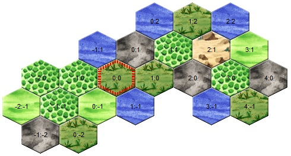

---
# cSpell:locale fr
alias: le-monde-d-eressea
---
# Le Monde d'Eressea

## Géographie

<div class="lore-dialogue">
Selen Ard'Ragorn regarda la porte lorsque Rahel, sa jeune novice, entra maladroitement dans la petite chambre du panneau de la bibliothèque du temple.
Un peu amusée, elle considéra la queue nerveusement agitée de la jeune chatte, qui tentait désespérément, mais sans succès, d'égaliser sa robe froissée.
"Approche-toi, mon enfant", demanda Selen.
Rahel s'approcha timidement de la table décorée où était assise l'abbesse.
Lorsque la jeune chatte aperçut le grand parchemin étalé sur la table, elle poussa un miaulement étonné.
Elle vit une carte détaillée, dessinée à la main, de tout le monde connu.
Les informations de tous les pays contrôlés par le Chat aux Yeux d'Or avaient été rassemblées et esquissées sur cette carte par des mains expertes.
Rahel distingua Andune, la petite île presque divisée en deux, au milieu de la mer.
Autour d'Andune, elle vit les contours bien connus des îles voisines, enchâssées dans l'océan éternel.
</div>

Le monde d'Eressea est composé d'une multitude d'îles et de continents de tailles très différentes.  

Les îles et les océans sont divisés en régions.  
Dans les régions, on trouve les unités des joueurs, les bâtiments et les bateaux, les paysans et différentes matières premières.  

<div class="lore-dialogue">
Rahel regardait encore, stupéfaite, la carte qui était en fait secrète, lorsque Selen pointa du doigt l'une des îles en bordure.
"Regarde, Rahel. Il y a là une île qui vient d'être ajoutée. Tu vois comment nos cartographes travaillent ?"
</div>



<div class="lore-dialogue">
La novice observa attentivement la carte. Apparemment, on s'était limité à l'essentiel lors de son élaboration et les régions découvertes n'avaient été que grossièrement classées.
Rahel reconnut des forêts et des montagnes, de nombreux marais et quelques plaines non boisées.
</div>

Dans cet exemple, à l'emplacement (0,0) il y a un marais, au nord-est à l'emplacement (0,1) il y a une montagne.  
Chaque faction d'Eressea a son propre système de coordonnées, qui peut être modifié avec l'ordre [[cmd-origin]], par exemple pour l'aligner sur celui d'une autre faction.  

<div class="lore-dialogue">
"Bien, mon enfant", confirma Selen au chat, bien plus jeune qu'elle.
"Ces cartes servent surtout à la navigation de nos bateaux.
Mais comme tu peux le constater, elles ne contiennent pas beaucoup d'informations.
C'est pourquoi..."
Et sur ces mots, Selen ouvrit un grand livre lourd qui avait été posé sur la table à côté de la carte.
"...c'est pourquoi nous recevons chaque semaine de chacun de nos éclaireurs un rapport détaillé sur les régions explorées.
Nous recueillons ces rapports car ils nous aident beaucoup à prendre des décisions."
</div>

Dans le monde d'Eressea, il existe plusieurs [[types-de-terrain]] (montagne, plaine, forêt, glacier, haut plateau, marais, désert et volcan) avec des caractéristiques différentes. Un explorateur qui ne craint pas les vastes océans peut découvrir d'autres types de régions exotiques au cours de ses voyages d'exploration. Un exemple est le "mur de feu", qui représente un obstacle insurmontable. En règle générale, les murs de feu délimitent les mondes d'Eressea. Cela permet d'éviter que des factions d'âges très différents ne s'affrontent facilement.  

<!-- TODO reorganize info. Some are partially duplicated in terrains.md -->
En fonction du type de terrain, la région accueillera un nombre différent de paysans pour gagner leur salaire hebdomadaire dans les champs.  
Ainsi, une plaine offre un emploi à beaucoup plus de paysans qu'un marais par exemple.  
De plus, les arbres réduisent le nombre d'emplois disponibles.  
Chaque paysan prend un emploi, chaque pousse d'arbre en prend quatre et chaque arbre en prend huit.  
Bien que les arbres puissent pousser à l'infini sur n'importe quel type de terrain, dans une région très boisée, il n'y aura quasiment plus d'emplois.  
Dans un glacier, très peu d'arbres suffisent à occuper presque tous les emplois, dans une plaine, il peut y avoir quelques centaines d'arbres et quelques milliers de paysans travaillant dans les champs.  
Mais même une région très densément boisée produit encore suffisamment de fruits, de racines ou de champignons pour que quelques paysans puissent en vivre.  
Ainsi, une petite partie des paysans trouve toujours un emploi dans la région : 10% du nombre maximal d'emplois dans une région, mais pas plus de 200, ne sont donc jamais bloqués par des arbres ou des pousses d'arbres.  
Par exemple, dans une montagne où il y a 150 arbres, 100 paysans trouvent encore un emploi (10% du nombre maximal d'emplois), bien qu'il n'y ait plus d'emplois disponibles en raison des nombreux arbres (150 arbres x 8 emplois occupés = 1200 emplois occupés &gt; 1000 emplois disponibles au maximum).  

La seule différence entre une plaine et une forêt est le nombre d'arbres et de pousses d'arbres dans la région.  
À partir d'un total de 600 arbres et/ou pousses, une plaine est considérée comme une forêt.  
Ainsi, il est possible de transformer une forêt en plaine en coupant du bois ou, inversement, de transformer une plaine en forêt en la reboisant.  

| Terrain   | max. travailleurs | min. travailleurs [^1] | Pierres pour routes | Plantes                                                                                               |
|-----------|------------------:|-----------------------:|--------------------:|-------------------------------------------------------------------------------------------------------|
| Désert    |               500 |                     50 |                 100 | tamaris, peyote, pourriture de sable                                                                  |
| Forêt     |            10 000 |                    200 |                  50 | amour d'Elfes, champignon cobalt, œil de chouette, lierre d'araignée, racine plate, témérité piquante |
| Glacier   |               100 |                     10 |                 250 | bégonia des glaces, pétale de cristal de neige tsugas blancs                                          |
| Highlands |             4 000 |                    200 |                 100 | champignon des fjords, mandragore, gousse                                                             |
| Marais    |             2 000 |                    200 |                  75 | herbe de clairon, morille, racine de nœud                                                             |
| Montagne  |             1 000 |                    100 |                 250 | cire fissurée, herbe de roche, lichen des cavernes                                                    |
| Plaine    |            10 000 |                    200 |                  50 | amour d'Elfes, champignon cobalt, œil de chouette, lierre d'araignée, racine plate, témérité piquante |
| Volcan    |               500 |                     50 |                 250 | --                                                                                                    |

Si le nombre d'emplois disponibles est dépassé, il devient très difficile pour les paysans de gagner le salaire hebdomadaire nécessaire - les paysans ont également besoin de 10 silver chaque tour pour survivre, qu'ils gagnent grâce au [travail].  
Les plus grands [[chateaux]] donnent un petit bonus de salaire dans la région, de sorte que les paysans qui travaillent peuvent éventuellement subvenir aux besoins de quelques autres paysans de la région, mais le risque que des paysans meurent, par exemple à cause d'une peste, augmente énormément si le nombre d'emplois disponibles est faible.  
De plus, si tous les emplois sont occupés, aucune unité de joueur ne peut plus travailler dans la région.  

Le type de terrain détermine également quelles [[plantes]] peuvent pousser dans la région.  
Un alchimiste pourra concocter des [potions] utiles à partir de différents ingrédients.  
Certaines herbes ne poussent que dans les déserts, d'autres ont besoin du climat humide d'un marais, il y a donc pour chaque terrain des herbes qui ne peuvent pousser que là.  
Les herbes qui y poussent ne peuvent toutefois pas être modifiées.  
Même si toutes les herbes de la région ont été arrachées, seule l'herbe qui y poussait à l'origine peut être replantée [[cmd-plant]].  
En cas de doute, il faut essayer de voir quelle herbe a déjà poussé ici.  
En général, les herbes ne poussent pas dans les volcans.  

Dans chaque région, il est possible de construire des [[routes]].  
Les coûts varient en fonction du terrain.  
De plus, la construction de routes dans les glaciers, les marais et les déserts n'est possible que si des [[batiments-speciaux]] s'y trouvent.  

De plus, le type de terrain détermine quelles [[ressources]] peuvent être trouvées dans la région et avec quelle chance.  
Ainsi, dans les montagnes et les glaciers où aucune ressource n'a encore été extraite, on trouve toujours du fer et des pierres dès le niveau d'extraction 1.  
Les montagnes ont cependant toujours nettement plus de ressources qu'un glacier.  
Dans un volcan, un tailleur de pierres a 50% de chances de trouver des pierres au niveau d'extraction 1, de même qu'un mineur n'aura que 50% de chances d'y trouver du fer au niveau 1.  
Un volcan peut donc fournir des pierres et du fer de la même manière qu'une montagne, ou seulement l'une des deux ressources, voire par malchance aucune.  
L'exploitation d'un volcan est bien sûr beaucoup plus dangereuse, car celui-ci peut entrer en éruption de temps en temps et causer des dommages considérables aux personnes qui se trouvent dans la région.  
En résumé, on peut retenir que dans ces trois types de régions (montagnes, glaciers et volcans), on trouvera toujours des pierres et/ou du fer au niveau 1 - si tant est qu'il y en ait dans la région.  

Mais d'autres types de régions (plaines/forêts, marais, déserts, hautes terres) peuvent aussi offrir du fer et/ou des pierres avec une certaine probabilité.  
Dans ces régions, le géologue peut toutefois avoir besoin d'un peu plus d'expérience, car le gisement n'est pas nécessairement présent au niveau d'extraction 1.  
Ainsi, il se peut que le fer commence quelque part entre les niveaux d'extraction 1 et 7, et que l'on trouve des pierres entre les niveaux d'extraction 1 et 4 - à condition que la région possède cette ressource.  
Il est utile de savoir qu'un géologue voit toujours des couches d'extraction deux fois plus profondes que son niveau de compétence.  
Par exemple, un mineur de niveau 3 voit le fer éventuellement présent jusqu'à une profondeur d'extraction maximale de la couche 6.  

Inversement, on peut donc aussi dire que si un mineur de niveau 4 ne voit pas de fer dans une plaine (où aucun fer n'a été extrait jusqu'à présent), il n'y a pas de fer non plus à cet endroit et le mineur peut tenter sa chance dans une autre région.  

Outre le fer et les pierres, il y a aussi le laen, un métal nettement plus rare.  
Si une montagne, un glacier ou un volcan abrite du laen, on en trouve à partir de la profondeur d'extraction 7.  
Dans d'autres types de régions, on peut aussi avoir de la chance de trouver du laen, mais alors éventuellement seulement au niveau d'extraction 7 à 10.  
Il faut donc un mineur de niveau 5 pour pouvoir exclure le laen dans chaque région.  
Si on a de la chance d'avoir trouvé une région avec du Laen, on a besoin d'une [mine] pour l'exploiter.  

<div class="lore-dialogue">
Selen regarda la jeune chatte Rahel, qui s'efforçait visiblement de mémoriser tous les chiffres et les dates.
"Rahel, mon enfant, tu n'as pas besoin de te souvenir de tous ces chiffres. Retiens plutôt que tu pourras les consulter ici, dans la bibliothèque, à tout moment."
La jeune novice s'efforçait de garder son calme, mais la magistrate Selen pouvait voir qu'elle était soulagée de ne pas avoir à se souvenir de toutes les informations immédiatement.
Selen poursuit :
"Mais on n'apprend pas seulement dans les académies et les bibliothèques, mais aussi dans les tavernes.
Car on y rencontre parfois des mineurs autour d'un hydromel, qui se racontent des histoires sur un métal encore plus rare que le laen.
Ils l'appellent adamantium. Il serait encore bien plus rare que le laen et seuls les mineurs les plus expérimentés l'auraient trouvé.
Mais avec ce métal, les meilleurs forgerons peuvent aussi fabriquer les meilleures armes et armures de tout Eressea."
</div>

Pour la région suivante, les informations sont expliquées en détail :

`Vîpot (3,-4), Desert, 0/1 Trees, 22 Stones/3, 190 Peasants, 5765 Silvers, 36 Horses.`

La région porte le nom de "Vîpot" et a les coordonnées (3,-4) vues depuis les coordonnées d'[[cmd-origin|origine]] de la faction.  
Un autre joueur - avec une autre ORIGINE - connaît la même région sous le même nom mais avec des coordonnées différentes.  
La région est un désert.  
Dans un désert, il y a au maximum 500 emplois libres.  
Vîpot compte actuellement 190 paysans.  
Chaque paysan consomme un emploi.  
En outre, il n'y a actuellement pas d'arbres mais une pousse.  
La pousse d'arbre consomme actuellement 4 emplois.  
Il reste donc actuellement 306 emplois libres dans la région.  

36 chevaux sauvages vivent dans la région.  
Les chevaux n'ont aucune influence sur le nombre d'emplois disponibles.  
L'[apprivoisement] permet de capturer les chevaux et de les utiliser par exemple pour le [transport] de marchandises ou d'en équiper des combattants.  
Ces derniers peuvent alors recevoir le [bonus de cavalerie] au combat s'ils sont au moins N2 en [équitation].  

De plus, il y a des pierres à Vîpot, ce qui n'est pas le cas de tous les déserts, mais cela arrive de temps en temps.  
Actuellement, il y a 22 pierres au niveau d'extraction 3 (couche 3).  
Pour découvrir ce gisement de pierres, il faut un tailleur de pierre au moins T2 en [extraction de pierres] (avec ce niveau, on peut voir des gisements de pierres jusqu'à la couche 4 maximum).  
Cependant, pour pouvoir effectivement extraire des pierres, l'unité doit être T3 T2 en [extraction de pierres].  

On peut en principe construire des [[routes]] dans chaque région non maritime pour augmenter la vitesse de déplacement par voie terrestre.  
Pour le désert de Vîpot, il faut 100 pierres pour construire une route sur l'un des 6 points cardinaux (W, NW, NE, E, SW, SW).  
De plus, la région voisine doit également avoir une route aménagée en direction de Vîpot, afin qu'il y ait une liaison routière.  
Mais comme Vîpot est un désert, il faut en plus un [caravanserail] entièrement construit.  
Un désert n'est donc pas forcément le premier choix pour construire un réseau routier, mais peut être un investissement rentable selon la géographie de l'île.  

La ligne contient également le montant actuel de silvers dans la région (la réserve).  
Ce montant est important pour estimer l'état de l'approvisionnement des paysans et combien les unités de joueurs peuvent avoir de [revenus] en divertissant ou en collectant des impôts.  

## Les régions d'Eressea

<div class="lore-dialogue">
Selen montra du doigt la page ouverte.
"Maintenant, toi, Rahel, regarde ce rapport et dis-moi ce que tu vois."
Rahel regarda intensément un instant avant de commencer.
</div>

Dans le rapport, toutes les régions dans lesquelles tu as une unité, par lesquelles tu as voyagé ou les régions océaniques que tu as aperçues depuis un [phare] sont listées :

`Tetos (−1,0), plain, 1042 peasants, 73/5 trees, 10953 silver, 132 horses. To the northwest lies the the forest of Faldorn (−2,1), to the northeast the plain of Litforuvys (−1,1), to the east the plain of Tumyvesfod (0,0), to the southeast the swamp of Titymovut (0,−1), to the southwest the plain of Livedfir (−1,−1) an to the west the mountain of Nipevan (−2,0).`

<div class="lore-dialogue">
— "Tout d'abord, il y a le nom par lequel la région est connue des locaux, ainsi que sa localisation.
Juste derrière, l'éclaireur a noté la nature de la région.
On y trouve également le nombre de paysans qui y vivent et une estimation approximative de leur richesse.
Le nombre d'arbres et de montures trouvés dans la région est également indiqué.
Les pierres et le fer n'y ont pas encore été découverts."
</div>

Les paysans vivant dans la région peuvent être recrutés dans sa faction avec l'ordre [[cmd-recruit]], les arbres peuvent être abattus et les chevaux domestiqués avec l'ordre [[cmd-make]].  

<div class="lore-dialogue">
— "Très bien, Rahel. Et que disent les lignes en dessous ?"
</div>

```text
The local market offers incense at a price of 4 silver.
Traders can sell balm for 12 silver, spice for 10 silver, gems for 21 silver, myrrh for 15 silver, oil for 12 silver and silk for 30 silver.

Statistics for Tetos (-1,0):

entertainment: max. 547 Silver
worker salary: 11 Silver
recruits: max. 26 peasants
luxury goods at this price: 10
people: 20
silver: 821
wood: 13
swords: 2
horses: 4
```

<div class="lore-dialogue">
La jeune novice rayonne de fierté devant son enseignante apparemment satisfaite.
— "Il s'agit, Magistra, d'informations supplémentaires que nos éclaireurs ont obtenues.
Tout d'abord, ils semblent avoir fait le tour du marché et noté les prix.
Dans la partie inférieure, ils indiquent combien d'argent les habitants de la région sont prêts à dépenser pour les forains et les musiciens, combien on peut obtenir pour des travaux simples, combien de paysans sont prêts à se joindre à un peuple et combien de marchandises sont vendues sur le marché au prix indiqué ci-dessus.
Les dernières lignes indiquent le nombre de personnes de notre peuple qui s'y trouvent et ce qu'elles transportent."
</div>

Dans `Luxuries`, vous pouvez voir la quantité de marchandises achetées ou vendues par les paysans pour le prix indiqué (voir aussi [Commerce]).  
Échanger plus de marchandises changera le prix durablement !  

Pour plus d'informations, lisez la section [Commerce].  

<div class="lore-dialogue">
— "Excellent, Rahel. Ce que tu as sous les yeux est un rapport complet.
Mais parfois, nous recevons des rapports moins complets, par exemple lorsqu'un éclaireur a simplement traversé une région à la hâte.
Nous ne recevons des rapports aussi détaillés que celui-ci que lorsque des membres de notre peuple s'y trouvent."
Selen désigne de la main la chaise de l'autre côté de la table.
"Tu peux t'asseoir maintenant, mon enfant".
Rahel s'approcha de la chaise, s'assit et émit un bref ronronnement, mélange de satisfaction de ne pas avoir apparemment déçu son professeur et d'attente de ce qui allait suivre.
La consacrée des Chats aux Yeux d'Or se pencha en arrière sur sa chaise et regarda Rahel un instant.
"Ce que tu vois là, ce ne sont que des chiffres. Des chiffres utiles, qui valent la peine d'être conservés, oui. Mais il est aussi important d'étudier les lois qui se cachent derrière ces chiffres."
Elle se leva, plongea la main dans le sac qu'elle avait placé sous la table et en sortit un autre parchemin qu'elle étala sur la table, au-dessus de la carte.
Rahel y jeta un regard intéressé, mais ne reconnut d'abord qu'un dessin chaotique fait de lignes plus ou moins horizontales. Elle regarda son enseignante d'un air interrogateur.
— "Qu'est-ce que cela signifie, Magistra ?"
— "Ceci, mon enfant, est une tentative de suivre les lois de la nature.
Chaque semaine, le nombre d'arbres, de paysans et de chevaux d'une région change.
Ils meurent, naissent ou vont chercher fortune ailleurs. Je me suis efforcée de comprendre pourquoi ils font cela, sans jamais les interroger."
La consacrée sourit intérieurement.
"Il semble que beaucoup de choses dépendent de la place qu'il y a dans une région. Les paysans, les arbres et les chevaux se prennent mutuellement la place."
La novice désigna un deuxième petit dessin griffonné sur le bord du parchemin.
— "Et que signifie ce dessin ? Il ressemble presque au grand..."
— "Dans le grand dessin, Rahel, j'ai reporté les chiffres pour une région côtière plate avec un sol excellent.
Le plus petit dessin décrit le développement dans un marais inhospitalier.
Comme tu le vois, l'évolution est similaire, sauf que dans le marais, on trouve moins de tout."
</div>

## Le calendrier d'Eressea

<div class="lore-dialogue">
Selen Ard'Ragorn se leva de sa chaise. Comme toujours, Rahel admira la souplesse avec laquelle la vieille bibliothécaire et directrice du temple se déplaçait encore et se leva à son tour.
Elle savait déjà ce qui allait se passer. À la fin de chaque cours, la magistrate se promenait dans le vaste parc du Grand Temple et lui donnait d'autres leçons.
Ensemble, elles traversèrent un petit bois d'aulnes. Jusqu'à présent, Selen était restée silencieuse, mais elle s'adressa à Rahel.
"Tu vois le soleil couchant ? Si tôt déjà... L'hiver approche. Bientôt, la Lune des Tempêtes fera place au mois du Feu du Foyer. Une période de privation pour beaucoup.
Pour les colonies d'insectes, par exemple, car elles ne peuvent pas se reproduire pendant les mois d'hiver."
— "Oui, Magistra. Mais au moins nos marins respirent, le temps des grandes tempêtes d'automne est passé et la mer est à nouveau plus sûre."
— "Tu as raison, Rahel. Il y a donc du bon dans tout cela."
Jusque tard dans la soirée, les gardes du temple pouvaient les voir déambuler silencieusement dans le parc magiquement éclairé...
</div>

Dans le monde d'Eressea, l'année est divisée en neuf mois de trois semaines chacun.  

| Mois                    | Saison    | Fréquence des tempêtes |
|-------------------------|-----------|-----------------------:|
| Lune des Récoltes       | Été       |                  0.5 % |
| Brouillard Impénétrable | Automne   |                    3 % |
| Lune des Tempêtes       | Automne   |                    4 % |
| Feu du Foyer            | Hiver     |                  2.5 % |
| Vent des Glaces         | Hiver     |                  1.5 % |
| Neiges Envoûtantes      | Hiver     |                    3 % |
| Pluies de Fleurs        | Printemps |                    3 % |
| Vents Doux              | Printemps |                  0.5 % |
| Feu du Soleil           | Été       |                    3 % |

Chaque tour du jeu correspond à une semaine dans le monde.  
Pendant ce temps, on peut faire beaucoup de choses.  
Mais il y a certaines choses auxquelles il faut consacrer presque toute la semaine (pour en savoir plus, voir le chapitre [[ordres]]).  

Même si l'influence des saisons n'est généralement pas très marquée, certains domaines ou événements sont tout de même influencés de manière significative.  

En voici un bref aperçu :

- Les peuples d'[Insectes] recrutent difficilement en hiver
- Les tempêtes en [[deplacements|mer]] sont plus fréquentes en automne
- Les différentes phases de [croissance des forêts] sont liées à des saisons particulières
- En hiver, la croissance des [[plantes]] s'arrête

## Mois et saisons

### Lune des Récoltes

<!-- cspell:disable -->
*Harvest Moon (EN), Feldsegen (DE).*
<!-- cspell:enable -->

Premier mois d'été.

### Brouillard Impénétrable

<!-- cspell:disable -->
*Impenetrable Fog (EN), Nebeltage (DE).*
<!-- cspell:enable -->

Premier mois d'automne.

### Lune des Tempêtes

<!-- cspell:disable -->
*Storm Moon (EN), Sturmmond (DE).*
<!-- cspell:enable -->

Second mois d'automne.  

Durant ce mois, les tempêtes sont les plus fréquentes.  

### Feu du Foyer

<!-- cspell:disable -->
*Hearth Fire (EN), Herdfeuer (DE).*
<!-- cspell:enable -->

Premier mois de l'hiver, qui en compte trois.

Les [[plantes|plantes]]{title="Herbs"} cessent de croître, jusqu'au retour du printemps.  

### Vent des Glaces

<!-- cspell:disable -->
*Icewind (EN), Eiswind (DE).*
<!-- cspell:enable -->

Deuxième mois d'hiver.

### Neiges Envoûtantes

<!-- cspell:disable -->
*Snowbane (EN), Schneebann (DE).*
<!-- cspell:enable -->

Troisième mois d'hiver.

### Pluies de Fleurs

<!-- cspell:disable -->
*Flowerrain (EN), Blütenregen (DE).*
<!-- cspell:enable -->

Premier mois du printemps.

### Vents Doux

<!-- cspell:disable -->
*Mild Winds (EN), Mond der milden Winde (DE).*
<!-- cspell:enable -->

Second mois du printemps.

### Feu du Soleil

<!-- cspell:disable -->
*Sunfire (EN), Sonnenfeuer (DE).*
<!-- cspell:enable -->

Second mois d'été.

## Voir aussi

- [[argent|L'argent]]
- [[cmd-recruit]][1]
- [[cmd-entertain]]

Poursuivre la lecture : [[factions]].

[^1]: quelque soit le nombre d'arbres.

<!-- From [https://wiki.eressea.de/index.php?title=Welt/fr&oldid=16558] -->

[potions]: ./alchemy.md#potions
[travail]: ./silver.md#travail
[mine]: ./buildings-others.md#mine
[apprivoisement]: ./skills-list.md#apprivoisement "Taming"
[équitation]: ./skills-list.md#equitation "Riding"
[extraction de pierres]: ./skills-list.md#extraction-de-pierres "Quarrying"
[transport]: ./travel.md#chevaux-et-chariots
[bonus de cavalerie]: ./war.md#bonus-et-malus
[caravanserail]: ./buildings-others.md#caravanserail
[revenus]: ./silver.md#revenus
[phare]: ./buildings-others.md#phare
[Commerce]: ./silver.md#commerce
[Insectes]: ./races.md#insectes
[croissance des forêts]: ./resources.md#ressources-forestieres
[1]: ./silver.md#recruter
